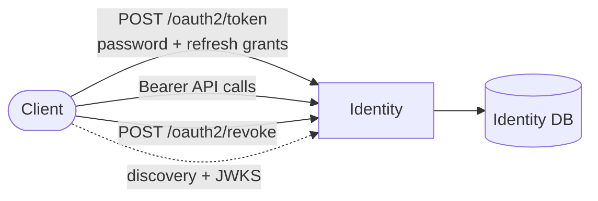
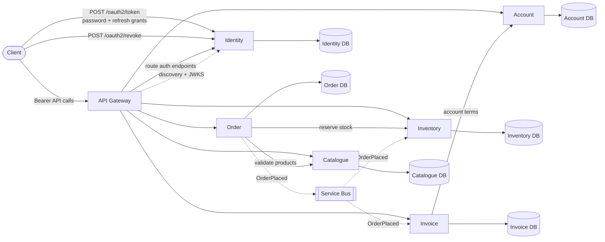

# JOrder

[](https://dotnet.microsoft.com/)
[](https://www.postgresql.org/)
[](https://www.docker.com/)
[](https://kubernetes.io/)
[](https://xunit.net/)
[](https://github.com/johang13/JOrder/actions/workflows/build-and-test.yml?query=branch%3Amain)

## Overview

JOrder is a sample .NET 10 microservices application for stock management and order processing. It acts as a practical reference for production-oriented patterns.

## Patterns & Practices

- **Result pattern** — typed `Result<T>` / `Error` abstractions replacing exception-driven control flow
- **Attribute-driven DI** — `[ScopedService]`, `[SingletonService]`, `[TransientService]` for zero-boilerplate registration
- **EF Core interceptors** — `AuditableInterceptor` automatically stamps `CreatedAt`, `CreatedBy`, `UpdatedAt`, `UpdatedBy`
- **Rate limiting** — attribute-driven per-endpoint fixed-window and sliding-window limits via `[RateLimit]`
- **OAuth2 / token service** — Identity supports password and refresh-token grants, mints JWTs (RSA RS256), and exposes discovery + JWKS endpoints. Downstream services validate through `/.well-known/openid-configuration` + `/.well-known/jwks.json`, and can forward user Bearer tokens with `BearerTokenForwardingHandler`.
- **Request logging middleware** — structured timing and origin logging, skipping health probe paths
- **Clean shared library** — `JOrder.Common` houses cross-cutting concerns reused across all services
- **Unit tested** — xUnit + NSubstitute, with a shared `JOrder.Testing` base for controller test infrastructure

## High Level Solution Design

### Current State



### Target State



These diagrams show the current OAuth2 contract: `POST /oauth2/token` supports `password` and `refresh_token`, and `POST /oauth2/revoke` revokes refresh tokens. Downstream services validate JWTs with discovery + JWKS. Authorization Code flow (for the web client) is tracked in the [Identity Service README](src/JOrder.Identity/README.md#web-client-roadmap).

## Solution Structure

```
JOrder/
├── src/
│   ├── JOrder.Common/          # Shared library — cross-cutting concerns for all services
│   │   ├── Abstractions/       # Result<T> / Error pattern
│   │   ├── Attributes/         # DI registration & rate limit attributes
│   │   ├── Extensions/         # IHostApplicationBuilder, ControllerBase extensions
│   │   ├── Middleware/         # Request origin logging
│   │   ├── Models/             # AuditableEntity base
│   │   ├── Options/            # Strongly-typed config (JWT, DB, Service)
│   │   ├── Persistence/        # AuditableInterceptor
│   │   └── Services/           # CurrentUser
│   └── JOrder.Identity/        # Identity service (auth, JWT minting, user management)
│       ├── Application/        # Application layer (commands, handlers)
│       ├── Controllers/        # Auth & Users API controllers
│       ├── Persistence/        # EF Core DbContext & migrations
│       └── Services/           # Auth, token, and user services
└── tests/
    ├── JOrder.Testing/         # Shared test infrastructure (ApiControllerUnitTestBase etc.)
    ├── JOrder.Common.UnitTests/
    ├── JOrder.Identity.UnitTests/
    └── JOrder.Identity.IntegrationTests/
```

## Getting Started

### Prerequisites

- Unix-based environment (macOS/Linux) with `make` installed
- Windows users: use WSL2 (Ubuntu recommended) with `make` installed
- [Docker](https://docs.docker.com/get-docker/) (with Docker daemon running)
- [kubectl](https://kubernetes.io/docs/tasks/tools/) connected to a local cluster (e.g. [Docker Desktop](https://docs.docker.com/desktop/kubernetes/) or [kind](https://kind.sigs.k8s.io/))
- A default ingress controller installed in the cluster

Verify your environment is ready:

```sh
make preflight
```

### Running a Service Locally

No Kubernetes required — you can run any service directly with the .NET CLI. You'll need a reachable PostgreSQL instance (connection string in `appsettings.json`):

```sh
cd src/JOrder.Identity
dotnet run
```

To run the tests:

```sh
dotnet test
```

### Deploying to Kubernetes

Build a service image and roll it out:

```sh
make build identity
# or build all services
make build all
```

Deploy to the local Kubernetes overlay:

```sh
make deploy identity
# or deploy all services
make deploy all
```

Services are exposed at `<service>.jorder.localhost` — `*.localhost` resolves to `127.0.0.1` per RFC 6761, so no `/etc/hosts` edits are needed.

### Useful Commands

| Command | Description |
|---|---|
| `make preflight` | Verify Docker, kubectl, and ingress are ready |
| `make list-services` | List all discovered services and their ingress URLs |
| `make build <service\|all>` | Build Docker image(s) |
| `make deploy <service\|all>` | Build, push, and roll out to the local cluster |
| `make restart <service\|all>` | Restart running deployment(s) without rebuilding |

## Design Decisions

### Authentication & Inter-service Token Propagation

Every service validates incoming JWTs through discovery + JWKS, so there is no secret sharing or manual public-key distribution. Identity exposes `/.well-known/openid-configuration` and `/.well-known/jwks.json`; downstream services point `Authority` at identity and let JWT bearer middleware handle key fetch and rotation.

```csharp
// In any downstream service's Program.cs
builder.AddJOrderJwtValidation();
```

For synchronous service-to-service calls that originate from a user request (for example, Order -> Catalogue), the **same JWT the user presented** is forwarded outbound. `BearerTokenForwardingHandler` in `JOrder.Common` does this automatically; attach it to any typed `HttpClient` registration:

```csharp
builder.AddJOrderBearerForwarding();

builder.Services.AddHttpClient<ICatalogueClient, CatalogueClient>()
    .WithBearerForwarding();
```

`BearerTokenForwardingHandler` is registered by `AddJOrderBearerForwarding()`. The downstream service validates that same token with its own JWT bearer middleware, without a second auth round-trip.

### Inter-service Communication

Not all service-to-service calls are equal. JOrder distinguishes between calls that need an immediate response and those that are better handled asynchronously.

| Interaction | Style | Rationale |
|---|---|---|
| `Order → Catalogue` | Sync (HTTP) | Product prices and availability must be validated before an order is accepted |
| `Order → Inventory` | Sync (HTTP) | Stock reservation needs immediate confirmation to accept or reject the order |
| `Order → Invoice` | Async (event) | Invoice generation does not need to block the order response — triggered by `OrderPlaced` event |
| `Invoice → Account` | Sync (HTTP) | Invoice requires account terms (credit limits, payment terms) to generate correctly |
| `Inventory` (restock) | Async (event) | Low-stock and reorder threshold alerts are fire-and-forget notifications |

### Service Bus

A message broker (e.g. RabbitMQ or Azure Service Bus) acts as the async backbone. Services publish domain events and subscribe to the events they care about — no direct coupling between publisher and consumer. This means:

- **Order Service** publishes `OrderPlaced` and moves on
- **Invoice Service** and **Inventory Service** react independently at their own pace
- If a consumer is temporarily down, the broker holds messages until it recovers

## Roadmap

- [x] Initial project setup and architecture design
- [ ] Implement core microservices
  - [ ] Identity Service
    - [ ] JWT minting and auth
    - [ ] User management (registration, login)
    - [ ] Role assignment and permissions
  - [ ] Catalogue Service
    - [ ] Product management
    - [ ] Category management
    - [ ] Pricing metadata
    - [ ] Product lifecycle
  - [ ] Inventory Service
    - [ ] Stock availability
    - [ ] Stock movement
    - [ ] Reorder thresholds
  - [ ] Order Service
    - [ ] Order creation and management
    - [ ] Order status tracking
    - [ ] Order validation and processing
  - [ ] Invoice Service
    - [ ] Invoice generation
    - [ ] Invoice management
  - [ ] Account Service
    - [ ] Customer account management
    - [ ] Billing and shipping information
    - [ ] Account terms and conditions
    - [ ] Credit limits and payment terms
- [ ] Implement API Gateway
- [ ] Telemetry and monitoring
- [ ] Security hardening
- [ ] Documentation and sample client applications
