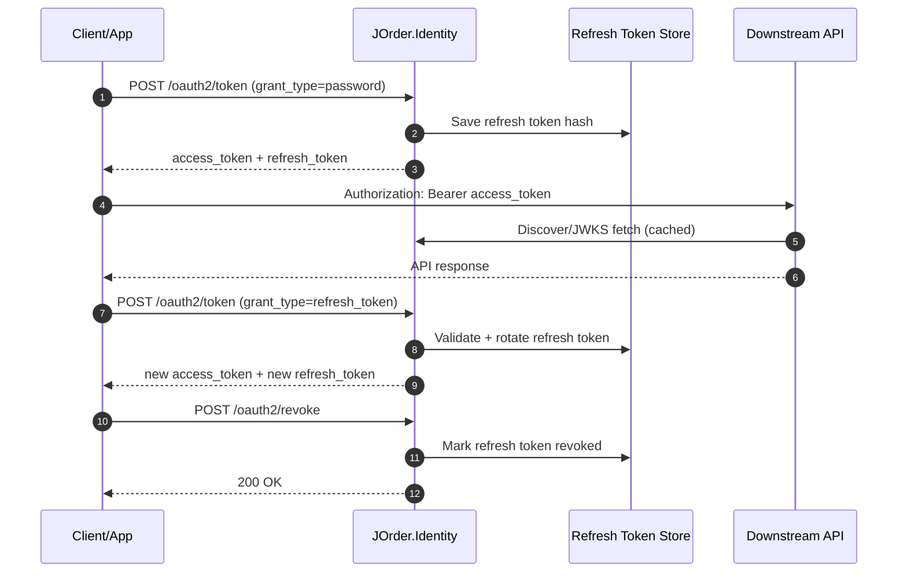
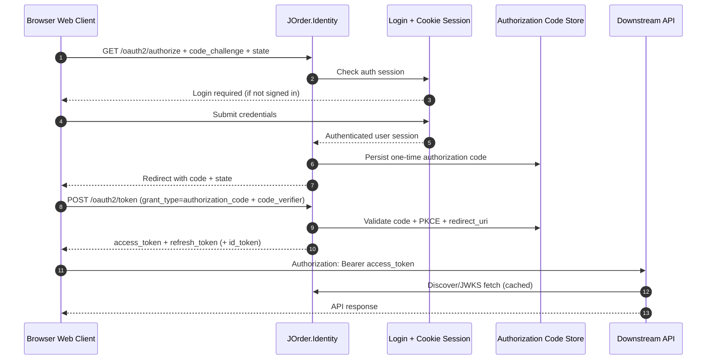

# JOrder.Identity

`JOrder.Identity` handles authentication and user management for JOrder. It is the identity authority for the services in this microservice architecture.

## OAuth2 Token Flows

**Resource Owner Password Credentials** (`POST /oauth2/token` with `grant_type=password`)
- Username/password authentication
- Issues access token (JWT, RS256) and refresh token
- Complies with RFC 6749 token endpoint specification

**Refresh Token** (`POST /oauth2/token` with `grant_type=refresh_token`)
- Exchanges refresh token for new access/refresh token pair
- Implements token rotation: new refresh token issued, old one invalidated
- Detects replay attacks (expired/revoked/inactive tokens rejected)

**Token Revocation** (`POST /oauth2/revoke`)
- Idempotent revocation endpoint per RFC 7009
- Revokes specified refresh token immediately

The discovery document at `GET /.well-known/openid-configuration` currently advertises only these grants. Authorization Code flow and OIDC features (`id_token`, `userinfo`, scopes) are planned for the web-client phase; see [Web Client Roadmap](#web-client-roadmap).

## Auth Flow Diagrams

### Current State



### Future State (Web Client)



## Additional Features

- User registration (returns HTTP 201, no tokens)
- JWT access token minting (RSA, RS256)
- Refresh-token rotation and revocation
- Session management (logout-all revokes all active tokens)
- JWKS/discovery endpoints for downstream JWT validation
- Authenticated user profile read/update and password change

## Runtime Overview

At startup, the service:

1. Registers common middleware/OpenAPI, explicit bearer-forwarding support, rate limiting, and DI-scanned services
2. Configures EF Core + ASP.NET Identity using `JOrderIdentityDbContext`
3. Loads JWT signing options and configures bearer validation for self-issued tokens
4. Runs warmup tasks (including signing key material warmup)

## API Endpoints

Base route prefixes are `[Route("[controller]")]` for controllers.

### OAuth2

- `POST /oauth2/token` (anonymous, form-encoded; supports `password` and `refresh_token` grants)
- `POST /oauth2/revoke` (anonymous, form-encoded; idempotent)

### Session

- `POST /Session/logout-all` (authorized)

### Users

- `POST /Users` (anonymous, rate-limited registration)
- `GET /Users/me` (authorized)
- `PATCH /Users/me` (authorized)
- `POST /Users/me/change-password` (authorized)

### OIDC / JWKS

- `GET /.well-known/openid-configuration` (anonymous)
- `GET /.well-known/jwks.json` (anonymous)

## Configuration

Key sections currently used:

- `JOrder:ServiceOptions`
- `JOrder:DatabaseOptions`
- `JOrder:Authentication:JwtSigning`

`JOrder:Authentication:JwtSigning` requires:

- `PrivateKeyPath`
- `Issuer`
- `Audience`
- `Algorithm`
- `AccessTokenLifetimeMinutes`
- `RefreshTokenLifetimeDays`

## Local Development

### Prerequisites

- .NET SDK 10.x
- Reachable PostgreSQL instance matching `JOrder:DatabaseOptions:ConnectionString`
- RSA private key file at the configured `JOrder:Authentication:JwtSigning:PrivateKeyPath`

## Local JWT key files

For local development, generate an RSA private key under `keys/` so `JOrder:Authentication:JwtSigning:PrivateKeyPath` can load `keys/signing-key.pem`.

```bash
cd /Users/chris/repos/JOrder/src/JOrder.Identity
mkdir -p keys
openssl genpkey -algorithm RSA -pkeyopt rsa_keygen_bits:2048 -out keys/signing-key.pem
chmod 600 keys/signing-key.pem
```

Other services validate tokens through OIDC discovery/JWKS, you do not need to manually export a public key file.

Optional: verify the private key format.

```bash
openssl rsa -in keys/signing-key.pem -check -noout
```

Finally, create a Kubernetes secret for the private key, so it can be mounted in the container.

```bash
kubectl create namespace jorder
kubectl create secret generic identity-signing-key \
  --from-file=signing-key.pem=src/JOrder.Identity/keys/signing-key.pem \
  -n jorder
```

## Run

From repo root:

```bash
dotnet run --project src/JOrder.Identity/JOrder.Identity.csproj
```

## Test

Run unit tests:

```bash
dotnet test tests/JOrder.Identity.UnitTests/JOrder.Identity.UnitTests.csproj
```

Run integration tests (requires Docker/Testcontainers):

```bash
dotnet test tests/JOrder.Identity.IntegrationTests/JOrder.Identity.IntegrationTests.csproj
```

---

## Web Client Roadmap

When work starts on the browser-based web client, the identity service needs the updates below.

### 1. Authorization Code + PKCE flow

Because a browser client cannot safely hold a secret, it should use Authorization Code + PKCE (RFC 7636).

**New endpoint: `GET /oauth2/authorize`**

- Validate `client_id` against a registered client (see §4)
- Validate `redirect_uri` exactly matches a registered URI
- Validate `response_type=code`
- Validate `code_challenge` + `code_challenge_method=S256`
- Validate `scope`
- Check for an active login session (cookie)
- If not logged in: redirect to login page
- If logged in: persist one-time auth code and redirect to `redirect_uri?code=...&state=...`

**New `grant_type=authorization_code` in `POST /oauth2/token`**

- Accept `code`, `redirect_uri`, `client_id`, `code_verifier`
- Look up stored auth code — verify not expired, not used, client match, exact redirect_uri match, PKCE `S256` hash
- Issue access token + refresh token (+ id_token if `openid` scope)
- Mark code consumed

**Auth code storage** — add an `AuthorizationCode` entity:

| Column | Description |
|---|---|
| `CodeHash` | SHA-256 of the raw code |
| `ClientId` | Must match client registry |
| `UserId` | Authenticated user |
| `RedirectUri` | Exact value used at `/authorize` |
| `Scopes` | Requested scopes |
| `CodeChallengeHash` | S256 challenge |
| `ExpiresAt` | Short lifetime (~2 min) |
| `ConsumedAt` | Set on first use; replay = reject |

### 2. Interactive login (cookie-based)

Add cookie authentication alongside the existing JWT bearer scheme:

```csharp
builder.Services.AddAuthentication()
    .AddCookie("Identity.Application", options => { ... });
```

Add a login form and handler (Razor Pages or minimal endpoint):

- `GET /account/login` — render login form
- `POST /account/login` — validate credentials, call `SignInAsync`, redirect back to `/authorize`
- `POST /account/logout` — call `SignOutAsync`, redirect

The `/oauth2/authorize` endpoint checks the cookie session to decide whether to prompt login. The cookie is **not** sent to APIs — it is only used within the identity service itself.

### 3. Client registry

Add a `Client` entity/table:

| Column | Description |
|---|---|
| `ClientId` | Stable identifier (e.g. `jorder-web`) |
| `ApplicationType` | `public` — no client secret for browser apps |
| `RedirectUris` | Allowed redirect URIs (exact match) |
| `PostLogoutRedirectUris` | Allowed post-logout redirect URIs |
| `AllowedGrantTypes` | `["authorization_code"]` |
| `RequirePkce` | `true` always for public clients |

For this project, one pre-configured client in `appsettings.json` is enough; dynamic registration is not required.

### 4. ID token

When the `openid` scope is present, issue an ID token alongside the access token:

- Extend `TokenMintingService.MintAccessToken` or add `MintIdToken`
- Include standard claims: `sub`, `iss`, `aud`, `exp`, `iat`, `nonce`
- Add `id_token_signing_alg_values_supported` back to the discovery document

### 5. Discovery metadata additions

After the above is in place, add this to `WellKnownController`:

```json
{
  "authorization_endpoint": "https://identity.jorder.localhost/oauth2/authorize",
  "response_types_supported": ["code"],
  "scopes_supported": ["openid", "profile", "email", "offline_access"],
  "code_challenge_methods_supported": ["S256"],
  "id_token_signing_alg_values_supported": ["RS256"]
}
```

Then update `SecuritySchemeTransformer` to advertise Authorization Code flow so Scalar/OpenAPI tooling can use interactive login.

### 6. OpenAPI scheme update

Restore the OAuth2 Authorization Code scheme in `SecuritySchemeTransformer`:

```csharp
["OAuth2"] = new OpenApiSecurityScheme
{
    Type = SecuritySchemeType.OAuth2,
    Flows = new OpenApiOAuthFlows
    {
        AuthorizationCode = new OpenApiOAuthFlow
        {
            AuthorizationUrl = new Uri("/oauth2/authorize", UriKind.Relative),
            TokenUrl = new Uri("/oauth2/token", UriKind.Relative),
            Scopes = { ["openid"] = "...", ["offline_access"] = "..." }
        }
    }
}
```
